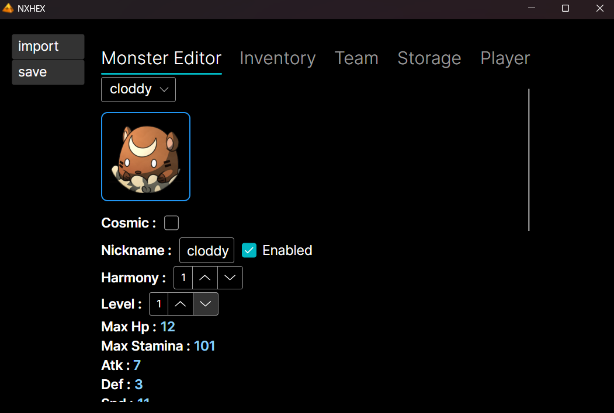
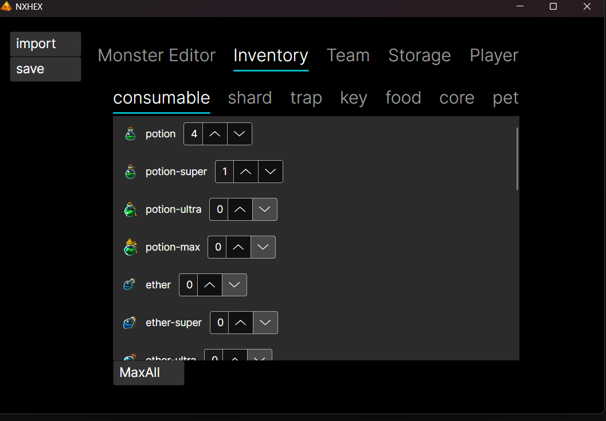
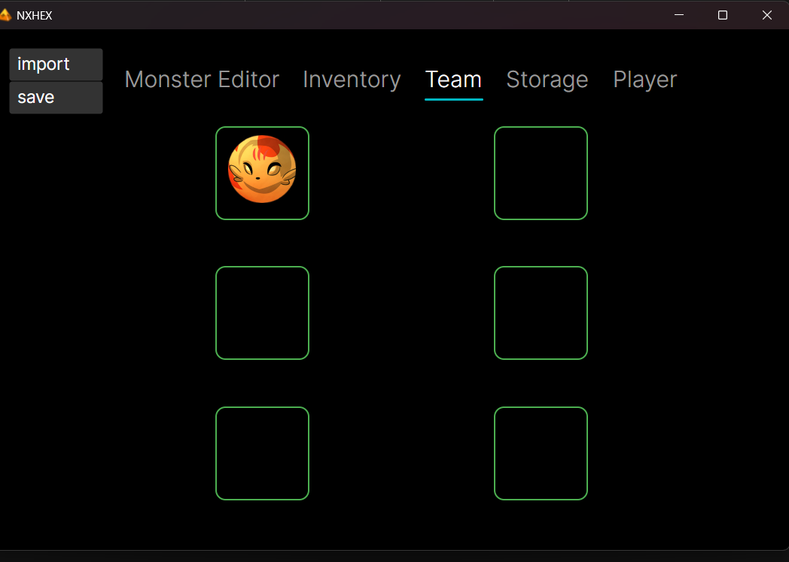
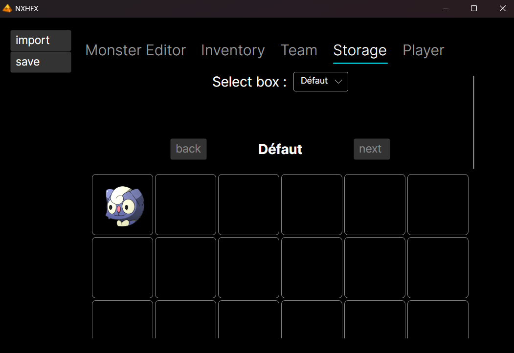
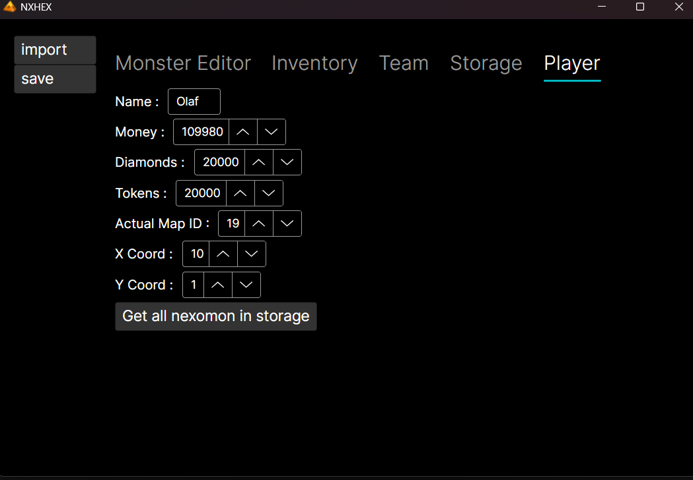

# NXHEX - Nexomon: Extinction Save Editor

**Complete and cross-platform save editor for Nexomon: Extinction**

NXHEX is a save editor built with **Avalonia UI**. It lets you easily modify every aspect of your game.

### Features
- Edit any Nexomon (party or storage box):
  - Level, skills, cores
  - **Cosmic status**
  - **Harmony**
  - Nickname
- Full inventory editor (all categories + companions) + max everything in 1 click
- Change player name, money, diamonds, tokens
- Modify current map and exact player coordinates
- Fill the entire storage with every Nexomon in the game in 1 click

**More complete than the old Synthlight editor (2022)** and available on **Windows, Linux and macOS**.

### Downloads
→ [Latest version (v1.0.1)](https://github.com/Olaf758/NXHEX-Nexomon-Extinction-Save-Editor/releases)

### Screenshots

### Compatibility
NXHEX works with the latest version of Nexomon: Extinction.

### Save File Location (Steam)
NXHEX works on **Windows, Linux and macOS** (x64 + ARM64).

Your save files are located here:

- **Windows**  
  `C:\Program Files (x86)\Steam\userdata\[YOUR STEAM ID]\1196630\remote`

- **Linux**  
  `~/.steam/steam/userdata/[YOUR STEAM ID]/1196630/remote`

- **macOS** (Intel & Apple Silicon / ARM)  
  `~/Library/Application Support/Steam/userdata/[YOUR STEAM ID]/1196630\remote`

- Replace `[YOUR STEAM ID]` with your own Steam account ID (this number is different for every user).  
- Each file is named `data-<number>.dat` → the number indicates the save slot.

### Warning
**Always make a backup** of your save file before editing!

**Built with Avalonia**
