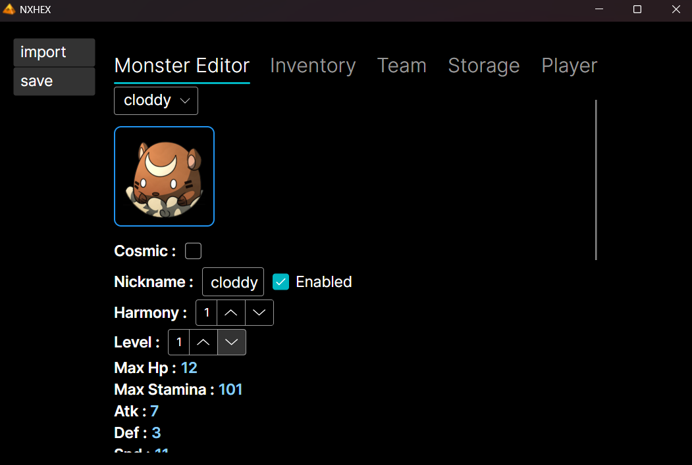
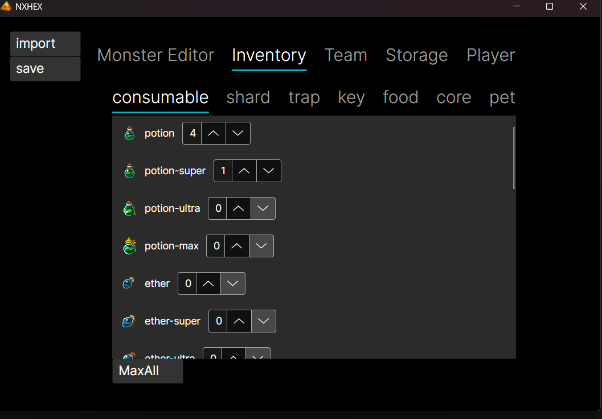
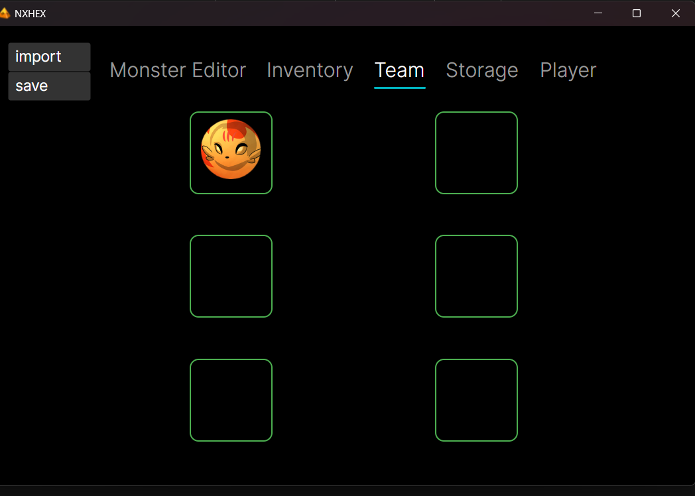
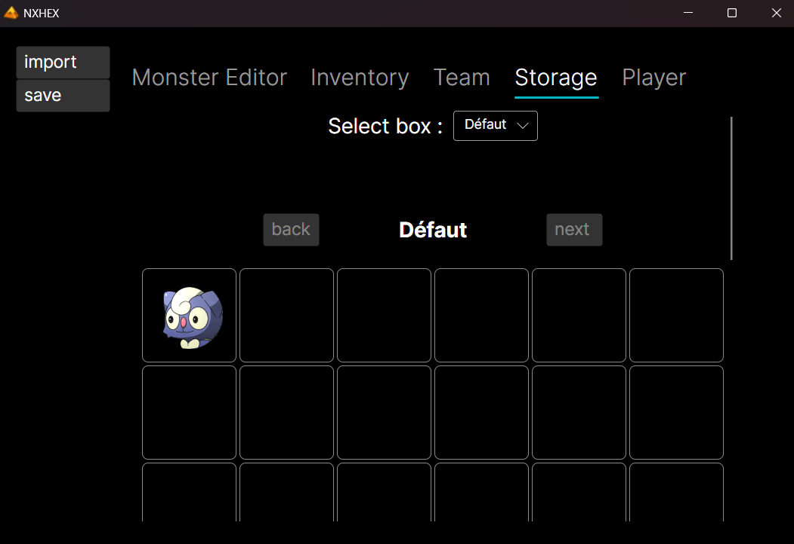
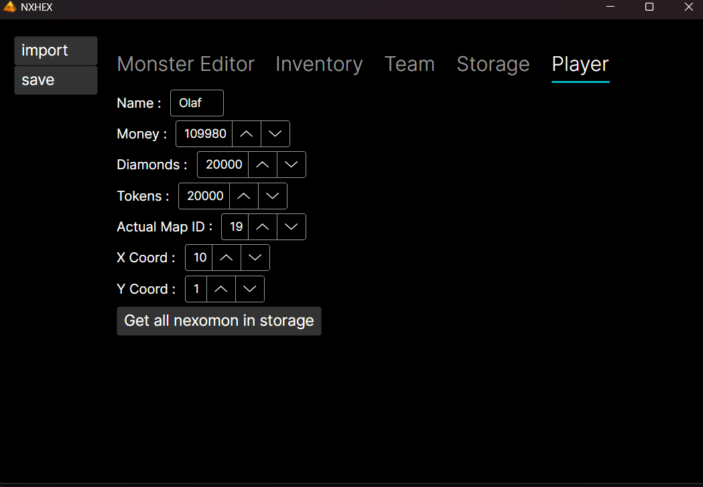

# NEXHEX - Nexomon and Nexomon: Extinction Save Editor

**Complete and cross-platform save editor for Nexomon: Extinction**

NEXHEX is a save editor built with **Avalonia UI**. It lets you easily modify every aspect of your game.

### Features
- Edit any Nexomon (party or storage box):
  - Level, skills, cores
  - **Cosmic status**
  - **Harmony**
  - Nickname
- Full inventory editor (all categories + companions) + max everything in 1 click
- Change player name, money, diamonds, tokens
- Modify current map and exact player coordinates
- Fill the entire storage with every Nexomon in the game in 1 click

### How to use:
To edit a nexomon, do a right-click and edit. To replace or put a Nexomon in any slot, right-Click and set. To delete, right-Click and delete.

### Compatibility
NEXHEX works with the latest version of Nexomon and Nexomon: Extinction.

### Save File Location (Steam)
NEXHEX works on **Windows, Linux and macOS** (x64 + ARM64).

Your save files are located here:

- **Windows**
  Nexomon : Extinction
  `C:\Program Files (x86)\Steam\userdata\[YOUR STEAM ID]\1196630\remote`
  Nexomon 
  C:\Program Files (x86)\Steam\userdata\[YOUR STEAM ID]\1191580\remote\

- **Linux**
   Nexomon : Extinction 
  `~/.steam/steam/userdata/[YOUR STEAM ID]/1196630/remote
  Nexomon
  ~/.steam/steam/userdata/[YOUR STEAM ID]/1191580/remote

- **macOS** (Intel & Apple Silicon / ARM)
  Nexomon : Extinction 
  ~/Library/Application Support/Steam/userdata/[YOUR STEAM ID]/1196630\remote`
  Nexomon
  
  ~/Library/Application Support/Steam/userdata/[YOUR STEAM ID]/1191580\remote`

- Replace `[YOUR STEAM ID]` with your own Steam account ID (this number is different for every user).  
- Each file is named `data-<number>.dat`for Nexomon : Extinction → the number indicates the save slot, and nexomon-save.dat for Nexomon .

### Warning
**Always make a backup** of your save file before editing!

### Downloads
→ [Latest version (v1.2)](https://github.com/Olaf758/NEXHEX/releases)

### Screenshots

### 🎮 Want a Save Editor for Another Game?

NXHEX is currently focused on **Nexomon: Extinction**, but I'm open to developing save editors for other single-player games.

**How to suggest a game:**
- Open an **Issue** on this GitHub repository, or
- Send an email to **secreator758@gmail.com**  
  - Subject: Name of the game  
  - Body: Game details (platform, link to Steam/Epic page, whether saves are local, etc.)

**Important notes:**
- Priority will be given to the most requested and interesting games.
- If the game is paid, you will need to provide a game key/copy **if I accept** to work on it.
- I'm also open to compensations via https://ko-fi.com/snowman758/donate .

I'm looking forward to your suggestions!

### ☕ Support the Project

If NXHEX has saved you time or helped you enjoy Nexomon or Nexomon: Extinction even more, consider supporting its development!

**Every donation is highly appreciated and helps me continue updating the editor and working on new features.**

**Direct link:** [https://ko-fi.com/snowman758](https://ko-fi.com/snowman758)

**Thank you so much** to everyone who supports the project ❤️

**Built with Avalonia**
